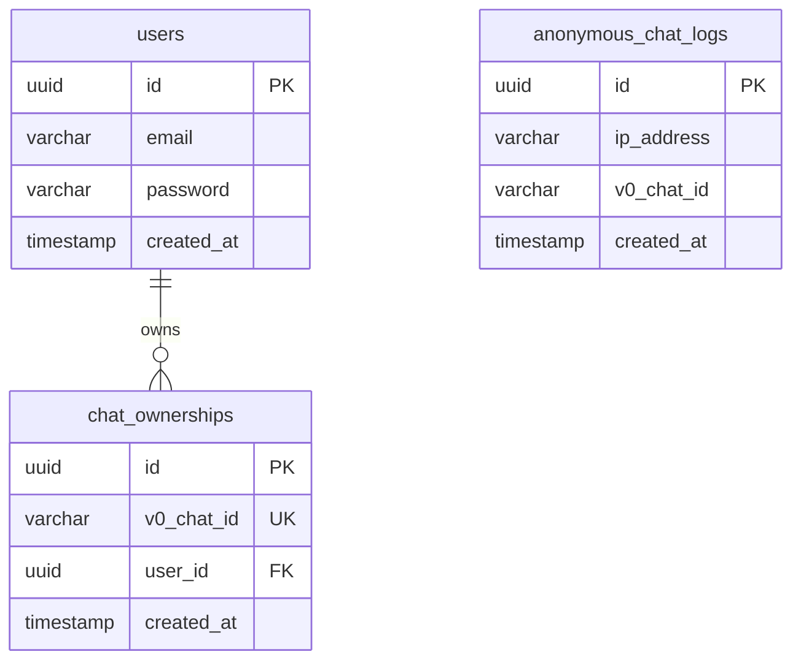

# Architecture Documentation

This document provides a comprehensive overview of the v0-clone architecture, including the agentic system, database design, and deployment strategy.

## Table of Contents

1. [Overview](#overview)
2. [Agentic System](#agentic-system)
3. [Directory Structure](#directory-structure)
4. [Database Architecture](#database-architecture)
5. [Deployment](#deployment)
6. [Development Workflow](#development-workflow)
7. [Testing Strategy](#testing-strategy)

## Overview

v0-clone is a Next.js application that replicates the v0.dev experience with added features for multi-tenancy, authentication, and autonomous development through an agentic system.

### Tech Stack

- **Frontend**: Next.js 15, React 19, Tailwind CSS 4
- **Backend**: Next.js API Routes, NextAuth.js
- **Database**: PostgreSQL with Drizzle ORM
- **Testing**: Playwright for E2E tests
- **Deployment**: Vercel, Fly.io, or Render
- **AI**: v0 SDK for AI-powered code generation

## Agentic System

The agentic architecture enables autonomous development workflows through specialized agents.

### Agent Roles

```
┌─────────────────────────────────────────────────────────┐
│                    Development Cycle                     │
└─────────────────────────────────────────────────────────┘

  User Input
      ↓
  ┌─────────┐
  │ Planner │ → Breaks down specs into tasks
  └─────────┘
      ↓
  ┌─────────┐
  │  Coder  │ → Implements features
  └─────────┘
      ↓
  ┌─────────┐
  │ Runner  │ → Tests & validates
  └─────────┘
      ↓
  ┌─────────┐
  │ Critic  │ → Reviews code
  └─────────┘
      ↓
  ┌─────────┐
  │  Fixer  │ → Applies fixes (loops until green)
  └─────────┘
      ↓
  ┌───────────┐
  │ Publisher │ → Deploys
  └───────────┘
      ↓
  ┌────────────┐
  │ Archivist  │ → Archives release
  └────────────┘

  ┌──────────────┐
  │ DB Steward   │ → Parallel: Manages database
  └──────────────┘
```

### Agent Capabilities

#### Planner
- Analyzes requirements
- Creates task breakdown
- Identifies dependencies
- Estimates effort

#### Coder
- Writes TypeScript/React code
- Implements UI components
- Creates API routes
- Updates configurations

#### Runner
- Starts dev server
- Runs tests
- Executes builds
- Monitors processes

#### Critic
- Reviews code quality
- Checks security
- Validates performance
- Ensures accessibility

#### Fixer
- Applies patches
- Fixes test failures
- Resolves lint errors
- Iterates until passing

#### Publisher
- Builds production artifacts
- Deploys to platforms
- Generates changelogs
- Verifies deployments

#### DB Steward
- Generates migrations
- Seeds databases
- Detects drift
- Creates ER diagrams

#### Archivist
- Tags releases
- Archives artifacts
- Snapshots logs
- Maintains history

## Directory Structure

```
v0-clone/
├── agents/                  # Agent system prompts
│   ├── planner.md
│   ├── coder.md
│   ├── runner.md
│   ├── critic.md
│   ├── fixer.md
│   ├── publisher.md
│   ├── db-steward.md
│   ├── archivist.md
│   └── README.md
│
├── app/                     # Next.js app directory
│   ├── (auth)/             # Authentication pages
│   ├── api/                # API routes
│   ├── chats/              # Chat pages
│   ├── layout.tsx
│   └── page.tsx
│
├── components/              # React components
│   ├── chats/
│   ├── home/
│   ├── providers/
│   └── shared/
│
├── contexts/                # React contexts
│
├── deploy/                  # Deployment templates
│   ├── vercel.json
│   ├── fly.toml
│   ├── render.yaml
│   └── README.md
│
├── hooks/                   # Custom React hooks
│
├── lib/                     # Utilities and core logic
│   ├── db/                 # Database code
│   │   ├── schema.ts
│   │   ├── migrate.ts
│   │   ├── seed.ts
│   │   ├── drift-check.ts
│   │   ├── generate-er-diagram.ts
│   │   ├── migrations/
│   │   └── README.md
│   ├── utils.ts
│   └── constants.ts
│
├── playwright/              # E2E testing
│   ├── helpers/
│   │   ├── browser.ts
│   │   ├── trace.ts
│   │   ├── snapshot.ts
│   │   ├── permissions.ts
│   │   └── storage.ts
│   ├── tests/
│   ├── playwright.config.ts
│   └── README.md
│
├── public/                  # Static assets
│
├── scripts/                 # One-liner scripts
│   ├── dev.sh
│   ├── test.sh
│   ├── build.sh
│   ├── deploy.sh
│   └── README.md
│
├── task.md                  # Rolling task log
├── .env.example             # Environment template
└── README.md
```

## Database Architecture

### Schema Design



### Database Operations

**Migrations**: Schema changes via Drizzle Kit
```bash
pnpm db:generate  # Generate migration
pnpm db:migrate   # Apply migration
```

**Seeding**: Populate with test data
```bash
pnpm db:seed  # Run seed script
```

**Drift Detection**: Check schema consistency
```bash
pnpm db:drift-check
```

**Documentation**: Generate ER diagram
```bash
pnpm db:er-diagram
```

## Deployment

### Supported Platforms

#### Vercel (Recommended)
- Automatic deployments from Git
- Edge functions support
- Built-in PostgreSQL
- Preview deployments

**Deploy**:
```bash
vercel --prod
```

#### Fly.io
- Global distribution
- Docker-based deployment
- Auto-scaling
- Persistent storage

**Deploy**:
```bash
fly launch --copy-config
fly deploy
```

#### Render
- Git-based deployment
- Managed PostgreSQL
- Auto-deploy on push
- Background workers

**Deploy**:
- Connect repo in dashboard
- Use `deploy/render.yaml`
- Configure environment variables

### Environment Variables

Required for all platforms:
- `V0_API_KEY`: v0 Platform API key
- `AUTH_SECRET`: NextAuth.js secret
- `POSTGRES_URL`: Database connection string

## Development Workflow

### 1. Setup
```bash
# Clone repository
git clone <repo-url>
cd v0-clone

# Install dependencies
pnpm install

# Copy environment file
cp .env.example .env
# Edit .env with your values

# Run migrations
pnpm db:migrate

# Seed database (optional)
pnpm db:seed
```

### 2. Development
```bash
# Start dev server
pnpm dev
# or
./scripts/dev.sh

# In another terminal, watch for changes
pnpm db:drift-check  # Check schema
```

### 3. Testing
```bash
# Run all tests
./scripts/test.sh

# Run specific tests
pnpm exec playwright test
pnpm exec playwright test --ui  # Interactive mode
```

### 4. Building
```bash
# Production build
./scripts/build.sh

# Verify build
pnpm start
```

### 5. Deployment
```bash
# Deploy to platform of choice
./scripts/deploy.sh vercel
./scripts/deploy.sh fly
./scripts/deploy.sh render
```

## Testing Strategy

### Unit Tests
- Component testing with React Testing Library (when added)
- Utility function tests
- API route tests

### Integration Tests
- Database operations
- Authentication flows
- API endpoints

### E2E Tests (Playwright)
- User workflows
- Multi-device testing
- Screenshot comparison
- Trace recording

### Test Organization
```
playwright/
├── tests/
│   ├── auth.spec.ts
│   ├── chat.spec.ts
│   └── responsive.spec.ts
└── fixtures/
    └── test-data.ts
```

## Computer Use (Manus-style)

The Playwright sandbox enables:

### Browser Automation
- Headless browser control
- DOM interaction (click, type, scroll)
- Screenshot capture
- Video recording

### Permission Gates
Operations require approval:
- File system writes
- Network requests
- Database modifications
- Deployments

### Trace Storage
All runs saved to `/runs/YYYYMMDD_HHMMSS/`:
- Playwright traces
- Screenshots
- Console logs
- Performance metrics
- Artifacts

### Usage Example
```typescript
import { launchBrowser, createContext } from './playwright/helpers/browser'
import { takeScreenshot } from './playwright/helpers/snapshot'
import { getRunDirectory, ensureRunDirectory } from './playwright/helpers/trace'

const runDir = getRunDirectory()
ensureRunDirectory(runDir)

const browser = await launchBrowser({ headless: true })
const context = await createContext(browser, { recordTrace: true })
const page = await context.newPage()

await page.goto('http://localhost:3000')
await takeScreenshot(page, runDir, 'homepage')
```

## Best Practices

### Code Quality
- Use TypeScript for type safety
- Follow ESLint rules
- Write meaningful tests
- Document complex logic
- Keep functions small and focused

### Database
- Always use migrations for schema changes
- Review generated SQL before applying
- Test migrations on development data first
- Use seeds for test data only
- Run drift checks regularly

### Security
- Never commit secrets
- Use environment variables
- Validate all inputs
- Sanitize outputs
- Follow OWASP guidelines

### Performance
- Optimize images
- Use Next.js Image component
- Implement proper caching
- Monitor bundle size
- Profile slow operations

### Accessibility
- Use semantic HTML
- Add ARIA labels
- Support keyboard navigation
- Test with screen readers
- Maintain color contrast

## Contributing

When contributing to this project:

1. Follow the existing code style
2. Write tests for new features
3. Update documentation
4. Run linters and tests before committing
5. Use the agent system for complex changes

## Resources

- [Next.js Documentation](https://nextjs.org/docs)
- [Drizzle ORM](https://orm.drizzle.team/)
- [Playwright](https://playwright.dev/)
- [v0 Platform API](https://v0.dev/docs/api/platform)
- [Vercel Deployment](https://vercel.com/docs)
- [Fly.io Deployment](https://fly.io/docs)
- [Render Deployment](https://render.com/docs)
